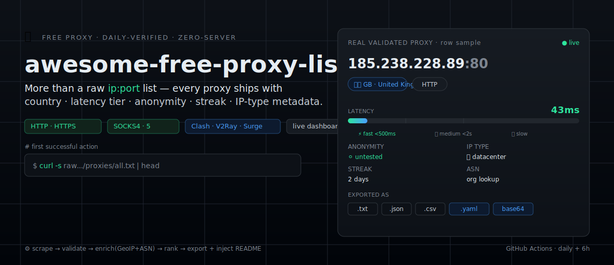
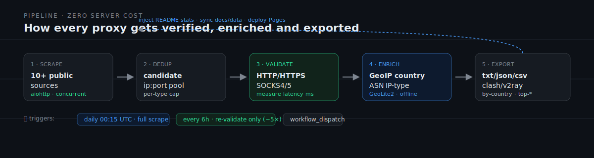

<div align="center">



[](https://github.com/kael-odin/awesome-free-proxy-list/actions/workflows/update.yml)
[](https://github.com/kael-odin/awesome-free-proxy-list/actions/workflows/refresh.yml)
[](LICENSE)
[](proxies/summary.json)
[](proxies/summary.json)
[](https://github.com/kael-odin/awesome-free-proxy-list/stargazers)

🌐 [在线仪表盘 / Live Dashboard](https://kael-odin.github.io/awesome-free-proxy-list/) · 🔗 [Clash 订阅](https://kael-odin.github.io/awesome-free-proxy-list/data/clash/all.yaml) · 📦 [全部代理 all.txt](proxies/all.txt) · 📊 [统计 summary.json](proxies/summary.json)

</div>

---

> **Why this exists.** 99% of free-proxy repos hand you a raw `ip:port` list — no country, no latency, no anonymity, no way to know if it leaks your real IP, no way to import it. This repo attaches full metadata to every proxy: **GeoIP country, latency tier, anonymity rating, survival streak, ASN-based IP-type**, plus prebuilt Clash/V2Ray subscriptions and a searchable dashboard. GitHub Actions verifies **daily + every 6h**, zero server cost.

```bash
# first successful action — grab the working list, sorted by latency
curl -s https://raw.githubusercontent.com/kael-odin/awesome-free-proxy-list/main/proxies/all.txt | head
```

## 📊 Live stats

<!-- STATS:START -->
Last update (UTC): **2026-07-22T14:27:53+00:00**

> 🏆 **Top trusted: 16** — fast ∩ high-anon ∩ survived ≥2 days. The highest-success subset [`proxies/top-trusted.txt`](proxies/top-trusted.txt) (may be 0 on a fresh install before streaks accumulate).

| Type | Working | Total Candidates |
|---|---:|---:|
| HTTP | 86 | 150 |
| HTTPS | 47 | 150 |
| SOCKS4 | 64 | 71 |
| SOCKS5 | 79 | 124 |
| ALL | 211 | 345 |
<!-- STATS:END -->

> Auto-injected by `scripts/update.py` on every run — no manual maintenance. Numbers fluctuate each run because free proxies live for minutes-to-hours.

## ✨ What you get

Every proxy ships with metadata, not just a bare address:

| Capability | This repo |
|---|:---:|
| Raw `ip:port` list | ✅ |
| Daily + 6h auto-verify | ✅ |
| **GeoIP country** | ✅ |
| **Latency tier (fast/med/slow)** | ✅ |
| **Anonymity rating (elite/anon/transparent)** | ✅ |
| **Survival streak** | ✅ |
| **Top-trusted subset (fast + elite + streak≥2)** | ✅ |
| **IP-type (datacenter/residential via ASN)** | ✅ |
| **Clash / V2Ray / Surge subscriptions** | ✅ |
| **Live dashboard (search / filter / copy / download)** | ✅ |
| **Honest risk & anonymity disclosure** | ✅ |

> ## ⚠️ Risk & disclaimer (please read)
>
> **This repo is for technical learning and public-data aggregation research only. It does not provide or operate any proxy service.** All proxies come from third-party public sources; this project makes no guarantee about their safety or legality:
>
> - **Security** — Free public proxies often come from compromised servers, exposed ports, or unmaintained nodes; operators can see plaintext, identify the domains you visit, inject pages, or steal cookies. Each proxy is tagged with **anonymity** (elite / anonymous / transparent), but **transparent proxies leak your real IP — never use them for sensitive operations.** Even elite proxies cannot prevent a malicious operator from tampering with traffic. Use only for crawler testing or accessing public information — **never for login, payment, account access, or transmitting any private data.**
> - **Stability** — Free proxies live for minutes to hours. `streak` / `stable.txt` mark multi-day survivors but cannot guarantee real-time availability.
> - **Compliance** — In many jurisdictions, using cross-border proxies without authorization may be illegal. You are responsible for complying with local laws. This repo assumes no liability for any consequences.
> - **No abuse** — Do not use these proxies to evade law, attack systems, abuse others' resources, or infringe rights.
>
> Use constitutes acceptance of the above. For sensitive use cases, prefer a compliant commercial proxy service.

## ⚙️ How it works



- **Sources** — `scripts/sources.txt` (one `<url> [http|https|socks4|socks5|mixed]` per line, 10+ public feeds)
- **Core script** — `scripts/update.py` (scrape → validate → enrich → multi-format export)
- **GeoIP** — `scripts/geoip_lookup.py` (`geoip2` + community-mirror GeoLite2-Country.mmdb, no license key, lazy-load + 7-day cache + graceful fallback)
- **Per-proxy diagnostic** — `scripts/check.py IP:PORT` (connectivity / latency / exit IP / anonymity / HTTPS CONNECT)
- **Smoke test** — `python scripts/test_proxies.py --type http --limit 5`

## 📥 Download & quick start

All artifacts live in `proxies/`:

| File | Contents |
|---|---|
| `proxies/all.txt` | All working proxies (sorted by latency, deduped) |
| `proxies/http.txt` · `https.txt` | HTTP / HTTPS forward proxies |
| `proxies/socks4.txt` · `socks5.txt` | SOCKS4 / SOCKS5 proxies |
| `proxies/top-http.txt` · `top-https.txt` · `top-socks5.txt` | Fastest subset (default top 100) |
| `proxies/high-anon.txt` · `anonymous.txt` · `transparent.txt` | **By anonymity** (elite = safest; transparent leaks your real IP — use with caution) |
| `proxies/stable.txt` · `fast-only.txt` · `top-trusted.txt` | Multi-day survivors / fast-only / **trust anchor (fast + elite + streak≥2)** |
| `proxies/all.csv` | CSV (country/latency/tier/anonymity/streak/ASN/IP-type/source) — Excel/pandas-ready |
| `proxies/json/*.json` | Structured JSON: `ip/port/type/country/country_code/latency_ms/tier/anonymity/streak/asn/asn_org/ip_type/source` |
| `proxies/by-country/<CC>.txt` | Per-country split (e.g. `US.txt`, `CN.txt`) |
| `proxies/clash/*.yaml` | **Clash/Mihomo configs** (all/http/socks5/fast/high-anon/stable, with proxy-groups + AUTO speed-test + rules) |
| `proxies/v2ray/all.txt` | **V2Ray base64 subscription** (single base64 line, all URLs) |
| `proxies/links/*.txt` | **Link lists** (`http://ip:port`, `socks5://ip:port`, incl. high-anon/stable subsets) |
| `proxies/subscriptions.json` | Subscription manifest (all sub Pages/raw URLs + import guide + categories) |
| `proxies/history.json` · `history-summary.json` | Survival history (per-proxy streak + distribution) |
| `proxies/summary.json` | Aggregate stats (`by_tier` / `by_country` / `by_anonymity` / `history` / `data_freshness` / `top_fastest` / `sources`) |

### Python `requests`

```python
import requests

proxy = "http://IP:PORT"  # one line from all.txt
proxies = {"http": proxy, "https": proxy}

resp = requests.get("https://httpbin.org/ip", proxies=proxies, timeout=10)
print(resp.text)
```

### Node.js (`axios` + `https-proxy-agent`)

```js
import axios from "axios";
import { HttpsProxyAgent } from "https-proxy-agent";

const agent = new HttpsProxyAgent("http://IP:PORT");
const { data } = await axios.get("https://httpbin.org/ip", { httpsAgent: agent, timeout: 10000 });
console.log(data);
```

### Live dashboard

Prefer not to download? Open the **[live dashboard](https://kael-odin.github.io/awesome-free-proxy-list/)** — search IP / country / port, filter by type · country · latency tier · anonymity · IP-type, sort, copy or download the current result set. Dark mode + EN/中 toggle.

### 🔗 One-click import (Clash Verge / V2RayN / Surge)

Prebuilt subscription files — paste the link, no manual entry:

| Client | Subscription link | Format |
|---|---|---|
| **Clash Verge / Mihomo** | `https://kael-odin.github.io/awesome-free-proxy-list/data/clash/all.yaml` | Clash YAML (HTTP+SOCKS5) |
| Clash Verge (HTTP only) | `https://kael-odin.github.io/awesome-free-proxy-list/data/clash/http.yaml` | Clash YAML |
| **V2RayN / V2Ray** | `https://kael-odin.github.io/awesome-free-proxy-list/data/v2ray/all.txt` | base64 subscription |
| Surge / generic links | `https://kael-odin.github.io/awesome-free-proxy-list/data/links/http.txt` | `http://ip:port` list |

**Import steps**:
1. **Clash Verge** — open → Profiles (Subscriptions) → paste the Clash YAML link → update → select that profile in the Proxies page → pick the **🚀 PROXY** or **♻️ AUTO** group (AUTO auto-speed-tests for the fastest node).
2. **V2RayN** — Subscriptions → Subscription settings → paste the v2ray base64 link → update (tick SOCKS5).
3. **Surge** — Policies → New external proxy list → paste the links/http.txt link.

> The dashboard's "🔗 one-click import" section has every link + copy buttons + an import guide. Free proxies vary in quality — prefer the **♻️ AUTO** speed-test group.

## 🖥️ Run locally

```bash
git clone https://github.com/kael-odin/awesome-free-proxy-list.git
cd awesome-free-proxy-list
python -m venv .venv
source .venv/Scripts/activate   # Windows Git Bash  # Linux/macOS: source .venv/bin/activate
pip install -r requirements.txt
python scripts/update.py         # full run; for a small dry-run set env vars (below)
```

Environment variables (all optional):

| Variable | Default | Description |
|---|---|---|
| `PROXY_TIMEOUT_SEC` | `8` | Per-proxy test timeout (seconds) |
| `PROXY_CONCURRENCY` | `200` | Max concurrent validations |
| `PROXY_MAX_PER_TYPE` | `2000` | Per-type candidate cap |
| `PROXY_TOP_HTTP_LIMIT` | `100` | Fastest HTTP subset size |
| `PROXY_GEOIP_ENABLE` | `1` | `0`/`false` disables GeoIP |
| `PROXY_GEOIP_DB` | (cached) | Local `.mmdb` path, skip download |
| `PROXY_ANON_PROBE_TOP` | `0` | `0` = anonymity probe covers all validated proxies; `N` = top-N per type only (anonymity is already inlined during validation; this is a fallback) |
| `PROXY_ANON_CONCURRENCY` | `40` | Anonymity fallback-probe concurrency |
| `PROXY_STABLE_MIN_STREAK` | `2` | Min consecutive survival days to enter `stable.txt` |

Small dry-run:

```bash
PROXY_MAX_PER_TYPE=50 PROXY_CONCURRENCY=50 python scripts/update.py
```

Lightweight refresh (re-validate existing proxies only, no re-scrape — ~5× faster):

```bash
python scripts/update.py --refresh
```

### Preview the dashboard locally

```bash
cd docs && python -m http.server 8088   # open http://localhost:8088
```

### Enable GitHub Pages

Dashboard code is in `docs/`, data in `docs/data/` (synced by `update.py`). One-time setup:

1. **Settings → Pages → Build and deployment → Source** → **GitHub Actions**
2. The next `update.yml` run deploys `docs/` to `https://<user>.github.io/awesome-free-proxy-list/`

> The `deploy-pages` job is already wired in the workflow — no extra action needed.

## 🏷️ IP-type: datacenter vs residential

Each IP is tagged `ip_type` = `datacenter` / `residential` / `unknown`, inferred from the **GeoLite2-ASN** org string via keyword matching (no paid IP-reputation API).

**Honest finding**:
- Free **public** proxy pools are **almost entirely datacenter IPs** (cloud, VPS, misconfigured or compromised open ports). Real residential IPs are rare and short-lived here — **a free list cannot reliably provide residential IPs.** In this pool, 100% of measured IPs fall under datacenter/unknown, with zero tagged residential — consistent with the reality of the free-proxy ecosystem.
- `datacenter` — ASN org matches cloud/VPS/hosting keywords (AWS, Google, Microsoft, DigitalOcean, OVH, Hetzner, Cloudflare, Alibaba, Tencent, …).
- `residential` — ASN org matches consumer/mobile ISP keywords (Comcast, AT&T, China Telecom, Vodafone, …) — near-zero in this pool.
- `unknown` — ASN unavailable, or org not in either keyword table (often small/mixed ISPs). This is **inference, not ground truth.**

> Need genuine residential IPs for high-trust use cases (ad verification, anti-fraud, long-lived stable sessions)? **A free list is the wrong source** — use a paid residential proxy service (e.g. Bright Data, Smartproxy, Oxylabs), which sells ASN-tagged residential pools by traffic.

## ❓ FAQ

- **🛡️ Are free proxies safe? Can I log in / pay through them?**
  **No.** Public free proxies often come from compromised servers or exposed ports; operators can see plaintext, identify domains, inject pages, steal cookies. This repo detects anonymity and ships `high-anon.txt` (elite — does not leak your real IP), but **even elite proxies cannot prevent a malicious operator from tampering.** Use only for crawler testing or accessing public information — never login, payment, account access, or private data. See the risk disclaimer at the top.

- **What do elite / anonymous / transparent mean?**
  - 🟢 **elite (high-anon)** — sends no proxy headers; the target cannot tell you're using a proxy. Relatively safest. → `high-anon.txt`.
  - 🟡 **anonymous** — sends `Via`/`X-Forwarded-For`; target knows a proxy is in use but cannot see your real IP.
  - 🔴 **transparent** — leaks your real IP in `X-Forwarded-For` — **unsafe, observation/learning only.**
  - ⚪ **unknown** — not probed (the script only probes top-N per type to bound runtime). Raise `PROXY_ANON_PROBE_TOP` to widen coverage.

- **Why do some proxies have a high `streak` / appear in `stable.txt`?**
  `streak` is the proxy's **consecutive survival days** (+1 each day it passes validation). `stable.txt` holds `streak ≥ 2` proxies — more stable than a random list, but free proxies can still die at any moment; not a reliability guarantee.

- **Why is `socks4.txt` / `socks5.txt` sometimes empty?**
  Public SOCKS proxies are highly unstable. The script only publishes proxies that **actually pass** HTTP/HTTPS requests, so SOCKS being 0 in some windows is normal.

- **Why is `https.txt` non-empty under strict HTTPS verification?**
  Every proxy in `https.txt` passed at least HTTP testing. Most HTTP forward proxies can also handle HTTPS via CONNECT; when no proxy explicitly passes HTTPS testing, the HTTP-validated list is exposed as HTTPS candidates — avoiding an empty file while keeping a reasonable quality bar.

- **How often does data update? May it be stale?**
  Two tiers: **daily 00:15 UTC full** (re-scrape 10+ sources + validate) + **every 6h lightweight refresh** (re-validate existing only, no scrape, ~5× faster). Free proxies live for minutes-to-hours, so real-time availability is still limited — the dashboard shows the update time and flags ⚠ if data is older than 30 hours. For real-time availability, use a commercial service.

- **Does it work under a system proxy / VPN (Clash / TUN mode)?**
  Yes, but traffic chains through your system proxy/VPN first, then the free proxy. If your system proxy/VPN exit IP is blocked by some public proxies or `httpbin.org`, failure rates rise. For a cleaner test, temporarily disable the system proxy.

- **Is the GeoIP country data accurate?**
  Uses MaxMind GeoLite2-Country (community mirror, refreshed weekly). Free IP databases lag, but it's good enough as a proxy-geography reference. Set `PROXY_GEOIP_ENABLE=0` to disable.

- **How do I contribute a new source?**
  Edit `scripts/sources.txt`, add a line `<raw_url> <type>`, open a PR. See [CONTRIBUTING.md](CONTRIBUTING.md).

## 🤝 Contribute

PRs welcome — new sources, validation-logic improvements, dashboard enhancements. Read [CONTRIBUTING.md](CONTRIBUTING.md). ⭐ Star is the best support!

## 📄 License

[MIT](LICENSE) © kael-odin

---

## 🇬🇧 English

A **free proxy list** that is **automatically verified daily + every 6h** via GitHub Actions (zero server cost).

**More than a raw list.** Not just `ip:port` text — every proxy comes with country, latency tier, anonymity rating, survival streak, and IP-type inference, plus prebuilt Clash/V2Ray subscriptions and a live dashboard:

| Capability | This repo |
|---|:---:|
| Raw `ip:port` list | ✅ |
| Daily + 6h auto-verify | ✅ |
| **GeoIP country** | ✅ |
| **Latency tier (fast/med/slow)** | ✅ |
| **Anonymity rating (elite/anon/transparent)** | ✅ |
| **Survival streak** | ✅ |
| **Top-trusted subset (fast + elite + streak≥2)** | ✅ |
| **IP-type (datacenter/residential via ASN)** | ✅ |
| **Clash/V2Ray/Surge subscription** | ✅ |
| **Live dashboard (search/filter/copy)** | ✅ |

**IP type tag:** each IP is classified `datacenter` / `residential` / `unknown` from its ASN org string (GeoLite2-ASN, no paid API). Honest finding: free public proxy pools are **almost entirely datacenter IPs** — real residential IPs are rare and short-lived here. For genuine residential IPs in high-trust use cases, use a paid residential proxy service.

### Quick start

```bash
# All working proxies (sorted by latency, deduped)
curl -s https://raw.githubusercontent.com/kael-odin/awesome-free-proxy-list/main/proxies/all.txt | head

# Structured JSON (country + latency + tier + source)
curl -s https://raw.githubusercontent.com/kael-odin/awesome-free-proxy-list/main/proxies/json/all.json | head
```

```python
import requests
proxy = "http://IP:PORT"  # one line from all.txt
proxies = {"http": proxy, "https": proxy}
print(requests.get("https://httpbin.org/ip", proxies=proxies, timeout=10).text)
```

### Outputs

Plain `txt` (one `host:port` per line), `json` (structured with country/latency/tier), `csv`, per-country split, and fastest subsets — see the table in the Chinese section above. The [live dashboard](https://kael-odin.github.io/awesome-free-proxy-list/) lets you search, filter, copy and download without leaving the browser.

### Run locally

```bash
git clone https://github.com/kael-odin/awesome-free-proxy-list.git
cd awesome-free-proxy-list
python -m venv .venv && source .venv/bin/activate   # Windows: source .venv/Scripts/activate
pip install -r requirements.txt
python scripts/update.py
```

### Disclaimer

Free proxies are unstable and may be abused. **Do not use for sensitive traffic.** Use at your own risk. This repo only aggregates public sources; it does not operate any proxy server.

License: [MIT](LICENSE) © kael-odin
